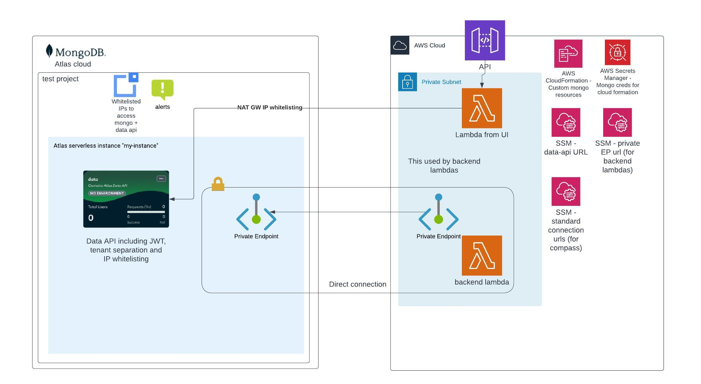

# Terraform modules and scripts

This repository provides some modules to ease deployments of various resources.

## Full mongo atlas deployment
The provided Terraform modules enable a full MongoDB Atlas deployment, encompassing a range of configurations aimed at optimizing the integration between AWS and MongoDB Atlas. Key features include:

- **MongoDB Atlas CloudFormation Custom Resources**: Automate the creation of database users and roles using MongoDB Atlas CloudFormation custom resources.
- **Developer Access Configuration**: Set up IP whitelisting for developers access, including the automatic configuration of NAT Gateway IPs for the Data API IP whitelist.
- **Private Endpoint Connectivity**: Establish two-way private endpoints between AWS and MongoDB Atlas to allow backend Lambda functions to access the database securely without traversing the public internet.
- **IP Whitelisting for Data API**: Although private connectivity for app services was not available at the time of deployment, this setup includes IP whitelisting as a secure alternative.
- **Alerts and Monitoring**: Configure comprehensive alerts, including pricing alerts, to be delivered to a designated email address. The setup supports adjustments for notifications through Slack and other channels.
- **Data API Configuration**: Includes full configuration of the Data API, with JWT authentication and filtering mechanisms for tenant separation.

### Architecture



### Setup

To deploy this MongoDB Atlas configuration, follow the steps below:

1. **API Key Generation**:
   - Navigate to the MongoDB Cloud Console Access Manager at `https://cloud.mongodb.com/v2#/org/<ORG_ID>/access/apiKeys`.
   - Create a new API key with the "Organization Project Creator" role.

2. **Environment Configuration**:
   - Ensure AWS is configured with the appropriate credentials and permissions. These should include the ability to enable custom CloudFormation resources, manage secrets and SSM parameters, read VPC configurations, and create private endpoints.

3. **Deployment**:
   - With the MongoDB Atlas API key pair generated, set them as environment variables and proceed with the Terraform commands to deploy the stack.

```bash
export TF_VAR_mongo_atlas_public_key=<public_key>
export TF_VAR_mongo_atlas_private_key=<private_key>
terraform init
terraform plan
terraform apply
```

### Sample lambda configuration that uses private connection (backend lambda)
This is a serverless framework example.
* Note that cloudformation and atlas has some race condition issues - so we should create the resources one by one (with depends on the previous one)
```yaml
anchors:
  vpc: &vpc
    securityGroupIds:
      - ${ssm:/${self:custom.stage}/infra/security_groups/security_group_that_can_access_mongo_private_endpoint, ''}
    subnetIds: <private_subnets>>
  mongoEnvironmentVars: &mongoEnvironmentVars
    CONNECTION_STRING_SSM_URL: /${self:custom.stage}/infra/mongodb/jit/private-endpoint/connection-string    
    MONGO_API_URL_PATH: /${self:custom.stage}/infra/mongodb/data-api/url
  mongo: # Some common properties for mongo
    commonUserProperties: &commonUserProperties
      AWSIAMType: ROLE
      ProjectId: ${ssm:/${self:custom.env_name}/infra/mongodb/project-id, ''}
      Profile: ${ssm:/${self:custom.env_name}/infra/mongodb/organization-id, ''}
      DatabaseName: "$external"
    commonRoleProperties: &commonRoleProperties
      ProjectId: ${ssm:/${self:custom.env_name}/infra/mongodb/project-id, ''}
      Profile: ${ssm:/${self:custom.env_name}/infra/mongodb/organization-id, ''}
      
      
functions:
  my-backend-lambda:
    handler: handler    
    vpc: *vpc
    environment: *mongoEnvironmentVars        
    iamRoleStatementsName: get-docs-role
    
Resources:
   MongoGetRole:
      Type: MongoDB::Atlas::CustomDBRole
      Properties:
        <<: *commonRoleProperties
        RoleName: atlas-get-docs-role
        Action: FIND
        Resources:
          - Collection: col
            DB: db
   
   GetDocsUser:
      Type: MongoDB::Atlas::DatabaseUser
      Properties:
        <<: *commonUserProperties
        Username: arn:aws:iam::${aws:accountId}:role/<service-name>-get-docs-role
        Roles:
          - RoleName: atlas-get-docs-role
            DatabaseName: "admin"
      DependsOn: [ MongoGetRole ]

```