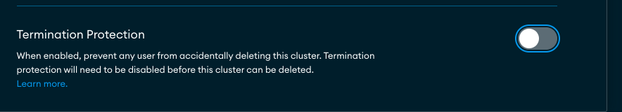
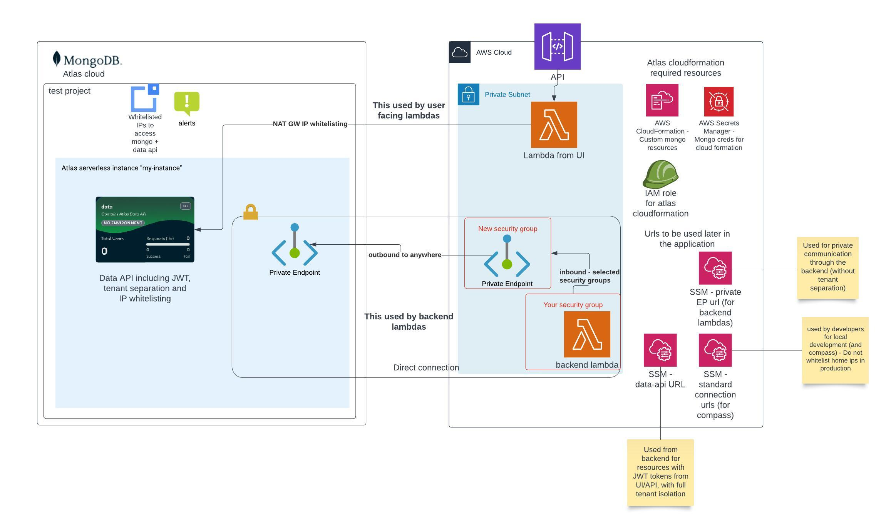
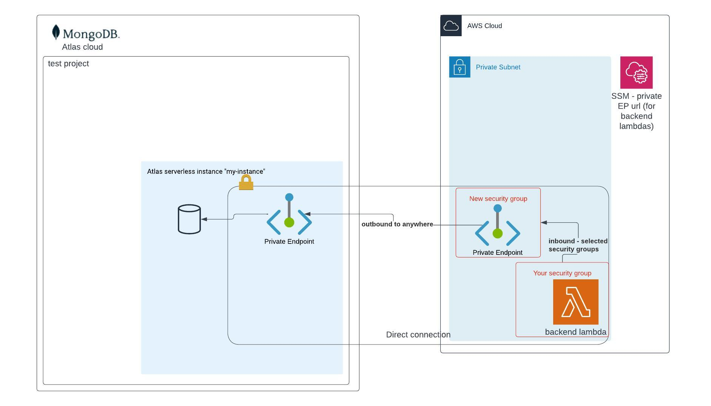
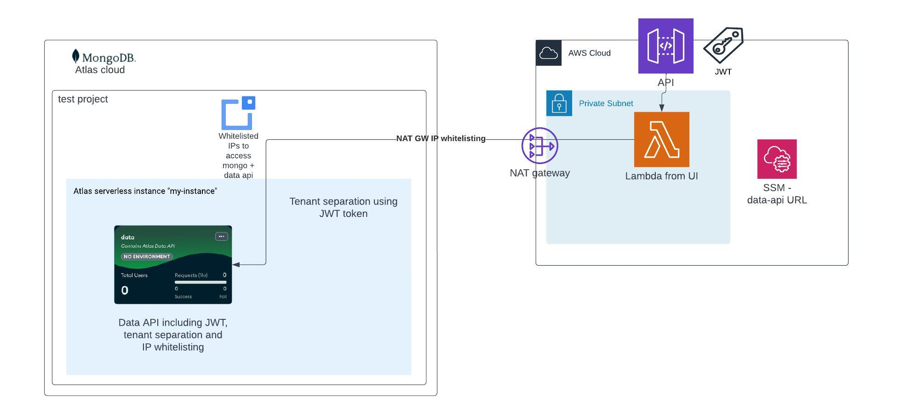

# MongoDB Atlas Serverless Deployment with Data API

This guide details a streamlined, one-click Terraform deployment for MongoDB Atlas serverless instances. It includes configurations for private endpoint connections, facilitating secure, non-customer-facing Lambda interactions with MongoDB, and leverages the Data API with JWT token authentication and tenant isolation for customer-facing Lambdas.

## Key Features and components

- **MongoDB Atlas CloudFormation Custom Resources**: Automate the creation of database users and roles using MongoDB Atlas CloudFormation custom resources, streamlining database management and security.
  - for more information click [here](https://github.com/mongodb/mongodbatlas-cloudformation-resources) 
- **Developer Access Configuration**: Implement IP whitelisting for developer access, including the automatic configuration of NAT Gateway IPs for the Data API IP whitelist, ensuring secure developer interactions with MongoDB Atlas.
- **Private Endpoint Connectivity**: Establish private endpoints between AWS and MongoDB Atlas to allow backend Lambda functions to securely access the database without traversing the public internet, enhancing the security of data access.
- **IP Whitelisting for Data API**: In lieu of private connectivity for app services at deployment, incorporate IP whitelisting as a secure method of accessing MongoDB Atlas, safeguarding data interactions.
- **Alerts and Monitoring**: Set up comprehensive alerts, including pricing alerts, to be delivered to a designated email address, with the capability for notification adjustments through Slack and other communication channels.
- **Data API Configuration**: Fully configure the Data API with JWT authentication and filtering mechanisms for tenant separation, facilitating secure and efficient data access and manipulation.
- **MongoDB Atlas Project Creation**: Establish a dedicated project within MongoDB Atlas to house serverless instances and the Data API, centralizing resources for streamlined management.
- **Serverless Instances on MongoDB Atlas**: Deploy one or more serverless instances within MongoDB Atlas, optimized for scalability and operational efficiency, catering to dynamic workload requirements including AWS Secret Manager secret to assist cloudformation in provisioning atlas resources through CloudFormation.
- **Parameters Management in AWS SSM Parameter Store**: Manage essential AWS parameters within the SSM Parameter Store, simplifying the access and use of Atlas URLs by other services, promoting operational efficiency and inter-service connectivity.


## Deployment Instructions

### Prerequisites
- **AWS Account**: You need an AWS account to deploy the resources.
- **VPC**: You need a VPC with private subnets to deploy the resources.
- **Security Groups**: You need security groups to control the traffic to and from AWS and MongoDB Atlas.
- **MongoDB Atlas Account**: You need a MongoDB Atlas account to deploy the serverless instance.
- **Terraform**: You need Terraform installed on your local machine to deploy the resources.

> **Verify Atlas serverless is supported in your region** - You can check out the supported regions [here](https://www.mongodb.com/docs/atlas/reference/amazon-aws/#std-label-amazon-aws)

Follow these steps to deploy your MongoDB Atlas serverless instance:

### 1. API Key Generation
- Visit the MongoDB Cloud Console Access Manager at `https://cloud.mongodb.com/v2#/org/<ORG_ID>/access/apiKeys`.
- Create a new API key with the "Organization Project Creator" role and note the public and private keys.

### 2. Environment Configuration
- Ensure AWS credentials and permissions are properly configured to enable custom CloudFormation resources, manage secrets and SSM parameters, read VPC configurations, and create private endpoints.

### 3. Setup your variables
- Fill in the required parameters in the `terraform.tfvars` file, their descriptions is available in the `variables.tf` file.
- Most importantly - obtain the following:
  - **organization_id**: Atlas organization to deploy into. from https://cloud.mongodb.com/v2#/preferences/organizations
  - **aws_vpc_id**: The VPC ID where the private endpoint will be configured.
  - **private_subnet_ids**: The private subnet IDs where the private endpoint will be created.
  - **aws_allowed_access_security_groups**: The security groups that will be allowed to access the private endpoint and to MongoDB Atlas.
  - **jwt_audience**: The audience for the JWT token used by your users.
  - **jwt_public_key**: The public key used to verify the JWT token.
  - **tenant_id_field_in_jwt**: The field in the JWT token that contains the tenant ID, this field is applied to all data-api requests as a field filter.
  - **display_name_field_in_jwt**: The field in the JWT token that contains the display name of the user, choose a value that will let you identify the user easily in the atlas console.

### 4. Deployment Process
Set your MongoDB Atlas API key pair as environment variables and execute the Terraform commands:

```bash
export TF_VAR_mongo_atlas_public_key=<public_key>
export TF_VAR_mongo_atlas_private_key=<private_key>
terraform init
terraform plan
terraform apply
```

### Cleanup
To clean everything up - you can comment out everything in `mongo_atlas.tf` or run `terraform destroy` for the module.

Before cleaning up, if you enabled `enable_termination_protection` you will need to go through the console to each instance and disable the **termination protection**.



## Architecture Overview



## Cost Breakdown

The cost of deploying MongoDB Atlas serverless instances with the Data API and private endpoint connectivity sums up to few dollars. Let's see some examples (rough estimations for usage)

<details>
<summary><b>Example 1</b>: 1 Serverless instance with CloudFormation Atlas resources, on 2 AWS availability zones, without any usage or continuous backup</summary>

Let's assume you will deploy the resources on aws - US east 1 region, and you will enable custom CloudFormation resources to provision DB users and roles through cloudformation (as seen [here](https://github.com/mongodb/mongodbatlas-cloudformation-resources)).
You will deploy the solution on 2 AWS availability zones.

You will then let it run for 1 month. Your charges would be calculated as follows:

* 1 secret in AWS Secret Manager to manage the secret used by CloudFormation: $0.40
* 1 AWS PrivateLink for secured backend connection, 2 availability zones: ~730 hours in a month * 2  0.01$ = 14.6$  
* The rest of the services are free.

Monthly total: **14.6$ + 0.40$ = 15$**
</details>

<details>
<summary><b>Example 2</b>: 1 Serverless instance, 1 availability zone and monthly data transfer of around 1GB and enabling continuous backup</summary>

Let's assume you will deploy the resources on aws - US east 1 region, and you will not enable custom CloudFormation resources..
You will deploy the solution on 1 AWS availability zone, enable continuous backup, and will transfer around 1GB of data in a month (write only).

You will then let it run for 1 month. Your charges would be calculated as follows:

* 1 AWS PrivateLink for secured backend connection, 1 availability zones: ~730 hours in a month * 2  0.01$ = 7.3$
* 1GB of data transfer: 0.10$ per GB = 0.01$ per GB on same region: 0.01$
* 1GB of write processing units on atlas: ~1.25$ per 1 million WPU = ~1.31$
* 1GB of data transfer using data-api (if used) - Free (on monthly free tier)
* Continuous backup for 1GB: around 0.20$ per GB = 0.20$

Monthly total: **7.3$ + 0.01$ + 1.31$ + 0.20$ = 8.82**
</details>

| Service                                       | Cost                                                                                                                                                                | Description                                                                                                                  | Links |
|-----------------------------------------------|---------------------------------------------------------------------------------------------------------------------------------------------------------------------|------------------------------------------------------------------------------------------------------------------------------|-------|
| AWS Secret Manager                            | $0.40                                                                                                                                                   | Secure storage for Atlas credentials for use with third-party CloudFormation templates.                                      | [Pricing Details](https://aws.amazon.com/secrets-manager/pricing/) |
| Third-Party AWS CloudFormation Operations     | Free for enabling and for 1000 handler operations per month                                                                                                         | Use MongoDB Atlas custom resources like `MongoDB::Atlas::CustomDBRole` and `MongoDB::Atlas::DatabaseUser` in CloudFormation. | [Pricing Details](https://aws.amazon.com/cloudformation/pricing/) |
| AWS IAM                                       | Free                                                                                                                                                    | Enables CloudFormation access to MongoDB credentials in Secret Manager and resource provisioning in Atlas.                   | - |
| AWS SSM Parameter Store                       | Free for standard parameters                                                                                                                                        | Stores Atlas URLs for easy access by other services.                                                                         | [Pricing Details](https://aws.amazon.com/systems-manager/pricing/#Parameter_Store) |
| AWS Interface Endpoint                        | $0.01 per AZ per hour, then depending on usage.                                                                                                                     | Connects backend Lambdas to MongoDB using private subnets without the Data API.                                              | [Pricing Details](https://aws.amazon.com/privatelink/pricing/#Interface_Endpoint_pricing) |
| MongoDB Atlas Serverless Instance             | Free for the instance, then variable according to the usage.                                                                                                        | Free for the instance; data usage determines additional costs.                                                               | [Pricing Details](https://www.mongodb.com/docs/atlas/billing/serverless-instance-costs/) |
| MongoDB Atlas Data API                        | Free tier: 1,000,000 requests or 500 hours of compute or 10,000 hours of sync runtime (whichever occurs first), 10GB of data transfer, Then according to the usage. | Shared monthly free tier across all App Services Apps in a project.                                                          | [Pricing Details](https://www.mongodb.com/docs/atlas/app-services/billing/) |
| MongoDB Atlas Private Endpoint for Serverless | Free                                                                                                                                                                | Connects to AWS private endpoints.                                                                                           | [Pricing Details](https://www.mongodb.com/docs/atlas/billing/additional-services/#private-endpoints-for-serverless-instances) |
| MongoDB Atlas Continuous backup               | Range from $0.20 to $0.60 per GB per month.                                                                                                                                                                | Continious backup for your instances                                                                                         | [Pricing Details](https://www.mongodb.com/docs/atlas/billing/serverless-instance-costs/) |


## Sample AWS Lambda configuration that can use either private connection or data-api
This is a [Serverless Framework](https://www.serverless.com/) example, the AWS Lambda must be in a VPC in order to access mongo.
* Note that CloudFormation and atlas has some race condition issues - so we should create the resources one by one (with depends on the previous one)

> When using data-api in the AWS Lambda, DB user and role are not needed as the current JWT credentials of the user will be used instead of the AWS Lambda role.


```yaml
anchors:
  vpc: &vpc
    securityGroupIds:
      - ${ssm:/${self:custom.stage}/infra/security_groups/security_group_that_can_access_mongo_private_endpoint, ''}
    subnetIds: <private_subnets>>
  mongoEnvironmentVars: &mongoEnvironmentVars
    CONNECTION_STRING_SSM_URL: /${self:custom.stage}/infra/mongodb/jit/private-endpoint/connection-string    
    MONGO_API_URL_PATH: /${self:custom.stage}/infra/mongodb/data-api/url
  mongo: # Some common properties for mongo
    commonUserProperties: &commonUserProperties
      AWSIAMType: ROLE
      ProjectId: ${ssm:/${self:custom.env_name}/infra/mongodb/project-id, ''}
      Profile: ${ssm:/${self:custom.env_name}/infra/mongodb/organization-id, ''}
      DatabaseName: "$external"
    commonRoleProperties: &commonRoleProperties
      ProjectId: ${ssm:/${self:custom.env_name}/infra/mongodb/project-id, ''}
      Profile: ${ssm:/${self:custom.env_name}/infra/mongodb/organization-id, ''}
      
      
functions:
  my-backend-lambda:
    handler: handler    
    vpc: *vpc
    environment: *mongoEnvironmentVars        
    iamRoleStatementsName: get-docs-role
    
Resources:
   MongoGetRole:
      Type: MongoDB::Atlas::CustomDBRole
      Properties:
        <<: *commonRoleProperties
        RoleName: atlas-get-docs-role
        Action: FIND
        Resources:
          - Collection: col
            DB: db
   
   GetDocsUser:
      Type: MongoDB::Atlas::DatabaseUser
      Properties:
        <<: *commonUserProperties
        Username: arn:aws:iam::${aws:accountId}:role/<service-name>-get-docs-role
        Roles:
          - RoleName: atlas-get-docs-role
            DatabaseName: "admin"
      DependsOn: [ MongoGetRole ]

```
> **Important caveat here** - While working with CloudFormation, there’s a race condition on those resources, so if they are created in parallel (even for different lambdas) - the deployment might fail. To currently solve it, make sure each resource depends on the previous atlas one (a_role -> a_user -> b_role -> b_lambda)

## Technical implementation details

### Backend connectivity
For Lambdas Without Data API and JWT Requirements:

- **Objective:** Connect to MongoDB Atlas serverless via a private endpoint.
- **Method:** Use VPC private endpoint creation and security group access.



- **Implementation Steps:**
  1. Create a [CustomDBRole and DatabaseUser](#sample-aws-lambda-configuration-that-can-use-either-private-connection-or-data-api), linking them to the IAM role of the target Lambda/container.
  2. Ensure Lambda/container is within the VPC, private subnets, and `aws_allowed_access_security_groups` includes the resources' security groups.
  3. Use SSM parameter for the connection string: `/<stage>/infra/mongodb/<instance_name>/private-endpoint/connection-string`.
  4. Example [pymongo](https://pymongo.readthedocs.io/en/stable/) connection:
     ```python
     client = InternalMongoClient(f"{connection_string}/?authSource=%24external&authMechanism=MONGODB-AWS&retryWrites=true&w=majority")
     my_collection = client["db"]["col"]
     ```

### User facing APIs connectivity
**For User-Triggered Lambdas:**

- **Objective:** Utilize the Data API for MongoDB Atlas serverless connections - imposing tenant separation using existing users JWT.
- **Method:** Implement IP Whitelisting due to the absence of private connectivity.


- **Implementation Steps:**
  1. Ensure Lambda/container uses VPC and NAT GWs for outbound IPs.
  2. Add required IPs to `ip_whitelist` and enable `add_mongo_ips_access_to_data_api`.
  3. Base URL for Data API calls is fetched from SSM: `/<stage>/infra/mongodb/data-api/url`.
  4. REST API usage example with JWT:
  ```bash
  curl -X POST "<base_url_from_ssm>/action/findOne" \
       -H "jwtTokenString: token" \
       -H "Content-Type: application/json" \
       -d '<JSON_BODY>'
   ```
  5. **Retry Logic for Unauthorized Responses:** Implement a decorator for retrying Data API requests encountering 401 errors, due to potential user provisioning delays. This includes a retry count of 3 with a 1-second pause between attempts.
  ``` python
  DATA_API_UNAUTHORIZED_REQUESTS_RETRY_COUNT = 3
  
  def retry_mongo_data_api_unauthorized_responses() -> Callable[..., Callable[..., Any]]:
    """
       This decorator is used to retry mongo data api requests that return 401 (Unauthorized) responses.
       This is used because of a known race condition when creating a new 'user' in mongo side.
       We retry 3 times with 1 seconds sleep between each try.
       """
    
    def func_wrapper(func: Callable[..., Any]) -> Callable[..., Any]:
        @functools.wraps(func)
        def wrapper(*args: Any, **kwargs: Any) -> Any:
            for i in range(DATA_API_UNAUTHORIZED_REQUESTS_RETRY_COUNT):
                try:
                    return func(*args, **kwargs)
                except HTTPError as e:
                    if e.response.status_code == HTTPStatus.UNAUTHORIZED:
                        logger.error(f"Failed to get data from mongo data api, retrying. Error: {e}")
                        sleep(1)
                        continue
                    raise e

        return wrapper

    return func_wrapper
  ```


### Shell scripts inside the code
This section outlines the use of shell scripts for configuring the Data API through the [Shell provider](https://registry.terraform.io/providers/scottwinkler/shell/latest/docs) resource. The scripts enable CRUD operations by setting the resource state through environment queries, ensuring alignment with the saved local state. Any detected discrepancies trigger an update script to align the target environment.

#### Shell Scripts: enable-data-api
The scripts enable the data-api configuration for a specific project, in a designated region with LOCAL deployment model. 

- **client_id**: The Data API client's unique identifier.
- **data_api_configurations**: Encoded configuration for the Data API, detailing versions, system execution permissions, validation techniques, etc.
- **data_api_id**: The Data API's unique ID.

State parameters:

``` json
{
  "client_id": "data-xxxxx",
  "data_api_configurations": "eyJ2ZXJzaW9ucyI6WyJ2MSJdLCJydW5fYXNfc3lzdGVtIjpmYWxzZSwicnVuX2FzX3VzZXJfaWQiOiIiLCJydW5fYXNfdXNlcl9pZF9zY3JpcHRfc291cmNlIjoiIiwibG9nX2Z1bmN0aW9uX2FyZ3VtZW50cyI6ZmFsc2UsImRpc2FibGVkIjpmYWxzZSwidmFsaWRhdGlvbl9tZXRob2QiOiJOT19WQUxJREFUSU9OIiwic2VjcmV0X25hbWUiOiIiLCJmZXRjaF9jdXN0b21fdXNlcl9kYXRhIjpmYWxzZSwiY3JlYXRlX3VzZXJfb25fYXV0aCI6dHJ1ZSwicmV0dXJuX3R5cGUiOiJKU09OIn0K",
  "data_api_id": "1234567890"
}
```

#### Shell Script: configure-data-api-security
Sets the IP whitelist for the Data API, allowing access to the designated IP addresses, Automatically adds the Nat Gateway IPs to the whitelist.

- **allowed_ips**: The IP addresses allowed to access the Data API.

``` json
{
  "allowed_ips": "3.209.100.200,1.1.1.1/32"
}
```

#### Shell Script: configure-data-api
The scripts configure data-api per serverless instance, adding the JWT configurations along with tenant separation ruleset.

State parameters:
- **default_rule_result**: Default rule set for tenant separation across collections.
- **jwt_provider_result**: JWT provider config, detailing audience, public key, and field mappings.
- **secret_id**, **secret_name**: Identify the public key used by your JWT provider.
- **service_id**, **service_name**: Designate the serverless instance with Data API enabled.

``` json
{
  "default_rule_result": {
  "_id": "xxxxxxx",
  "filters": [
      {
        "name": "tenant id filter",
        "query": {
          "tenant_id": "%%user.data.tenantId"
        },
        "apply_when": {
          "%%true": true
        }
      }
    ],
    "roles": [
      {
        "name": "readAccessDataAPI",
        "apply_when": {},
        "read": true,
        "write": true,
        "insert": true,
        "delete": true,
        "search": true
      }
    ]
  },
  "jwt_provider_result": {
    "_id": "yyyyyyyyy",
    "name": "custom-token",
    "type": "custom-token",
    "metadata_fields": [
      {
        "required": true,
        "name": "tenantId",
        "field_name": "tenantId"
      },
      {
        "required": false,
        "name": "email",
        "field_name": "name"
      }
    ],
    "config": {
      "audience": [
        "aud"
      ],
      "requireAnyAudience": true,
      "signingAlgorithm": "RS256",
      "useJWKURI": false
    },
    "secret_config": {
      "signingKeys": [
        "jwt-public-key"
      ]
    },
    "disabled": false
  },
  "secret_id": "1234567890",
  "secret_name": "jwt_public_key",
  "service_id": "1234567890",
  "service_name": "my-instance"
}
```