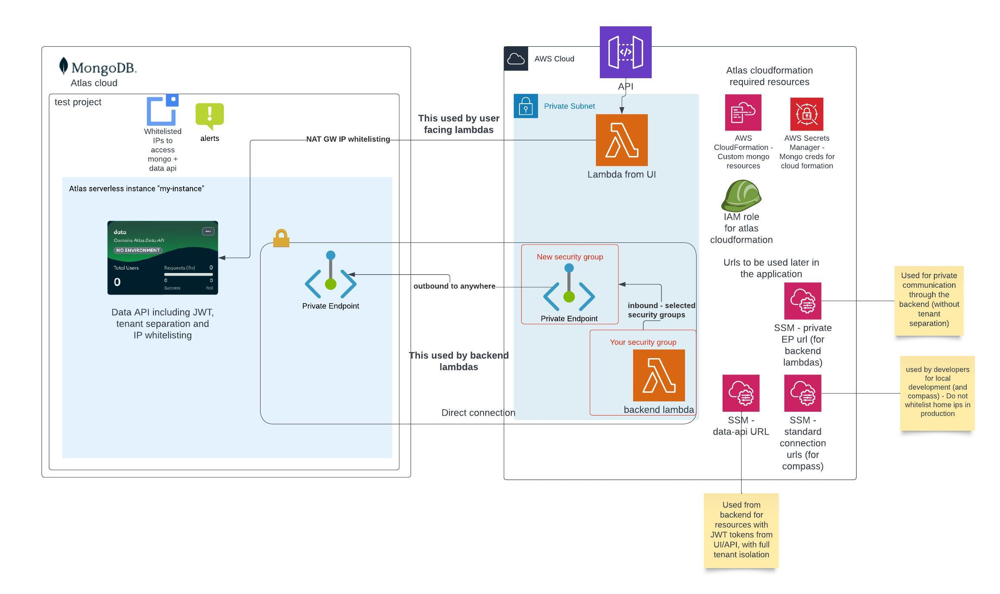

# MongoDB Atlas Serverless Deployment with Data API

This documentation provides an in-depth look at deploying a full MongoDB Atlas serverless instance using the Data API, with a focus on optimizing AWS integration. Our Terraform modules cover a broad spectrum of configurations to enhance your MongoDB Atlas experience.

## Key Features and components

- **MongoDB Atlas CloudFormation Custom Resources**: Automate the creation of database users and roles using MongoDB Atlas CloudFormation custom resources, streamlining database management and security.
- **Developer Access Configuration**: Implement IP whitelisting for developer access, including the automatic configuration of NAT Gateway IPs for the Data API IP whitelist, ensuring secure developer interactions with MongoDB Atlas.
- **Private Endpoint Connectivity**: Establish private endpoints between AWS and MongoDB Atlas to allow backend Lambda functions to securely access the database without traversing the public internet, enhancing the security of data access.
- **IP Whitelisting for Data API**: In lieu of private connectivity for app services at deployment, incorporate IP whitelisting as a secure method of accessing MongoDB Atlas, safeguarding data interactions.
- **Alerts and Monitoring**: Set up comprehensive alerts, including pricing alerts, to be delivered to a designated email address, with the capability for notification adjustments through Slack and other communication channels.
- **Data API Configuration**: Fully configure the Data API with JWT authentication and filtering mechanisms for tenant separation, facilitating secure and efficient data access and manipulation.
- **MongoDB Atlas Project Creation**: Establish a dedicated project within MongoDB Atlas to house serverless instances and the Data API, centralizing resources for streamlined management.
- **Serverless Instances on MongoDB Atlas**: Deploy one or more serverless instances within MongoDB Atlas, optimized for scalability and operational efficiency, catering to dynamic workload requirements.
- **Integration of MongoDB Atlas Data API with App Services**: Leverage the MongoDB Atlas Data API to enable seamless access from AWS Lambda functions, enhancing UI/API functionalities with secure JWT token-based authentication.
- **Custom Resources for MongoDB Atlas via CloudFormation**: Utilize custom CloudFormation resources for the efficient creation and management of database users and roles, further automating database administration tasks.
- **AWS Secret Manager for MongoDB Atlas Credentials**: Securely manage MongoDB Atlas credentials within AWS Secret Manager, ensuring the safe storage and access of sensitive information for use with third-party CloudFormation templates.
- **AWS IAM Role Configuration**: Configure an IAM role to provide CloudFormation with the necessary permissions for accessing MongoDB credentials in Secret Manager and for the provisioning of resources within Atlas, facilitating secure and automated resource management.
- **Parameters Management in AWS SSM Parameter Store**: Manage essential AWS parameters within the SSM Parameter Store, simplifying the access and use of Atlas URLs by other services, promoting operational efficiency and inter-service connectivity.

[Explore the Terraform modules](./mongodb_atlas)

## Architecture Overview



### Backend connectivity
For lambdas that don't require data api and JWT connectivity - you can utilize the private endpoint connectivity to connect to the MongoDB Atlas serverless instance. This is done by creating a private endpoint in the VPC and allowing the security groups to access the private endpoint.


### User facing APIs connectivity
For lambdas that your users trigger (with JWT token) - use the data api to connect to the MongoDB Atlas serverless instance. 

- This is done by IP Whitelisting - as at the time of this deployment, private connectivity for app services was not available. [More details](https://www.mongodb.com/docs/atlas/app-services/security/private-endpoints/)
- There's no need to configure NAT GW IPs, they are obtained and configured automatically


## Prerequisites
- **AWS Account**: You need an AWS account to deploy the resources.
- **VPC**: You need a VPC with private subnets to deploy the resources.
- **Security Groups**: You need security groups to control the traffic to and from AWS and MongoDB Atlas.
- **MongoDB Atlas Account**: You need a MongoDB Atlas account to deploy the serverless instance.
- **Terraform**: You need Terraform installed on your local machine to deploy the resources.

## Cost Breakdown

**On US east region**

| Service                                      | Cost                                                                                                                                                                | Description                                                                                                                 | Links |
|----------------------------------------------|---------------------------------------------------------------------------------------------------------------------------------------------------------------------|-----------------------------------------------------------------------------------------------------------------------------|-------|
| AWS Secret Manager                           | $0.40 for 1 secret                                                                                                                                                  | Secure storage for Atlas credentials for use with third-party CloudFormation templates.                                     | [Pricing Details](https://aws.amazon.com/secrets-manager/pricing/) |
| Third-Party AWS CloudFormation Operations    | Free for enabling and for 1000 handler operations per month                                                                                                         | Use MongoDB Atlas custom resources like `MongoDB::Atlas::CustomDBRole` and `MongoDB::Atlas::DatabaseUser` in CloudFormation. | [Pricing Details](https://aws.amazon.com/cloudformation/pricing/) |
| AWS IAM                                      | Free for 1 role                                                                                                                                                     | Enables CloudFormation access to MongoDB credentials in Secret Manager and resource provisioning in Atlas.                  | - |
| AWS SSM Parameter Store                      | Free for standard parameters                                                                                                                                        | Stores Atlas URLs for easy access by other services.                                                                        | [Pricing Details](https://aws.amazon.com/systems-manager/pricing/#Parameter_Store) |
| AWS Interface Endpoint                       | $0.01 per AZ per hour, then depending on usage.                                                                                                                     | Connects backend Lambdas to MongoDB using private subnets without the Data API.                                             | [Pricing Details](https://aws.amazon.com/privatelink/pricing/#Interface_Endpoint_pricing) |
| MongoDB Atlas Serverless Instance            | Free for the instance, then variable according to the usage.                                                                                                        | Free for the instance; data usage determines additional costs.                                                              | [Pricing Details](https://www.mongodb.com/docs/atlas/billing/serverless-instance-costs/) |
| MongoDB Atlas Data API                       | Free tier: 1,000,000 requests or 500 hours of compute or 10,000 hours of sync runtime (whichever occurs first), 10GB of data transfer, Then according to the usage. | Shared monthly free tier across all App Services Apps in a project.                                                         | [Pricing Details](https://www.mongodb.com/docs/atlas/app-services/billing/) |
| MongoDB Atlas Private Endpoint for Serverless | Free                                                                                                                                                                | Connects to AWS private endpoints.                                                                                          | [Pricing Details](https://www.mongodb.com/docs/atlas/billing/additional-services/#private-endpoints-for-serverless-instances) |

## Deployment Instructions

Follow these steps to deploy your MongoDB Atlas serverless instance:

### 1. API Key Generation
- Visit the MongoDB Cloud Console Access Manager at `https://cloud.mongodb.com/v2#/org/<ORG_ID>/access/apiKeys`.
- Create a new API key with the "Organization Project Creator" role.

### 2. Environment Configuration
- Ensure AWS credentials and permissions are properly configured to enable custom CloudFormation resources, manage secrets and SSM parameters, read VPC configurations, and create private endpoints.

### 3. Setup your variables
- Fill in the required parameters in the `terraform.tfvars` file, Their descriptions is available in the `variables.tf` file.
- Most importantly - obtain the following:
  - **organization_id**: Atlas organization to deploy into. from https://cloud.mongodb.com/v2#/preferences/organizations
  - **aws_vpc_id**: The VPC ID where the private endpoint will be configured.
  - **private_subnet_ids**: The private subnet IDs where the private endpoint will be created.
  - **aws_allowed_access_security_groups**: The security groups that will be allowed to access the private endpoint and to MongoDB Atlas.
  - **jwt_audience**: The audience for the JWT token used by your users.
  - **jwt_public_key**: The public key used to verify the JWT token.
  - **tenant_id_field_in_jwt**: The field in the JWT token that contains the tenant ID.
### 4. Deployment Process
Set your MongoDB Atlas API key pair as environment variables and execute the Terraform commands:

```bash
export TF_VAR_mongo_atlas_public_key=<public_key>
export TF_VAR_mongo_atlas_private_key=<private_key>
terraform init
terraform plan
terraform apply
```

### Sample AWS Lambda configuration that can use either private connection or data-api
This is a [Serverless Framework](https://www.serverless.com/) example, the AWS Lambda must be in a VPC in order to access mongo.
* Note that CloudFormation and atlas has some race condition issues - so we should create the resources one by one (with depends on the previous one)

> When using data-api in the AWS Lambda, DB user and role are not needed as the current JWT credentials of the user will be used instead of the AWS Lambda role.


```yaml
anchors:
  vpc: &vpc
    securityGroupIds:
      - ${ssm:/${self:custom.stage}/infra/security_groups/security_group_that_can_access_mongo_private_endpoint, ''}
    subnetIds: <private_subnets>>
  mongoEnvironmentVars: &mongoEnvironmentVars
    CONNECTION_STRING_SSM_URL: /${self:custom.stage}/infra/mongodb/jit/private-endpoint/connection-string    
    MONGO_API_URL_PATH: /${self:custom.stage}/infra/mongodb/data-api/url
  mongo: # Some common properties for mongo
    commonUserProperties: &commonUserProperties
      AWSIAMType: ROLE
      ProjectId: ${ssm:/${self:custom.env_name}/infra/mongodb/project-id, ''}
      Profile: ${ssm:/${self:custom.env_name}/infra/mongodb/organization-id, ''}
      DatabaseName: "$external"
    commonRoleProperties: &commonRoleProperties
      ProjectId: ${ssm:/${self:custom.env_name}/infra/mongodb/project-id, ''}
      Profile: ${ssm:/${self:custom.env_name}/infra/mongodb/organization-id, ''}
      
      
functions:
  my-backend-lambda:
    handler: handler    
    vpc: *vpc
    environment: *mongoEnvironmentVars        
    iamRoleStatementsName: get-docs-role
    
Resources:
   MongoGetRole:
      Type: MongoDB::Atlas::CustomDBRole
      Properties:
        <<: *commonRoleProperties
        RoleName: atlas-get-docs-role
        Action: FIND
        Resources:
          - Collection: col
            DB: db
   
   GetDocsUser:
      Type: MongoDB::Atlas::DatabaseUser
      Properties:
        <<: *commonUserProperties
        Username: arn:aws:iam::${aws:accountId}:role/<service-name>-get-docs-role
        Roles:
          - RoleName: atlas-get-docs-role
            DatabaseName: "admin"
      DependsOn: [ MongoGetRole ]

```